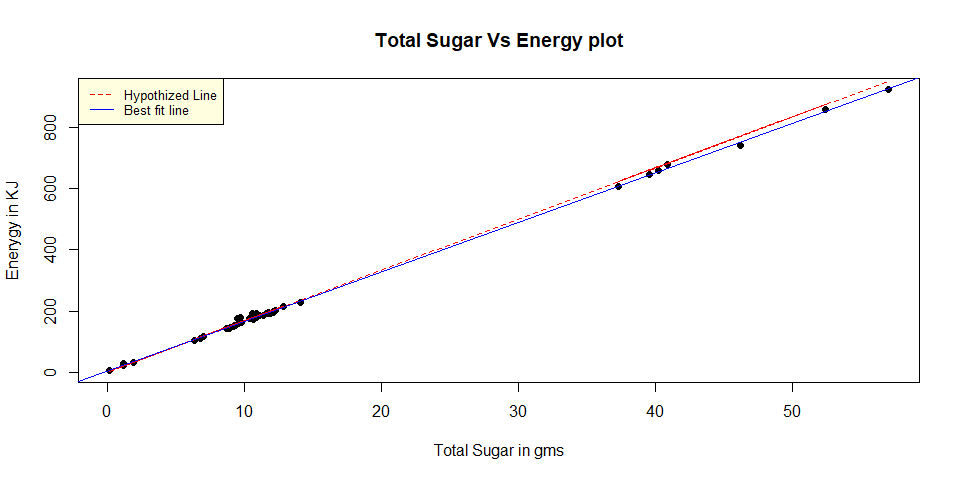

Linear Regression
================
Tapas Mishra
13/06/2019

In this documents , we will look , various questions and understand ,
how we can solve them by regression. In process , We will understand,
some R outputs

### Question 1

You may have been told that juice drinks are “nothing but sugar.” Read
in the dataset “cordial-simple.csv”, which has the nutrition information
for several different cordial brands and flavours. Consider predicting
Energy in kJ with grams of Total Sugar

1)  Suppose these drinks are ideed “nothing but sugar”, and sugar
    contains 16.7 kJ per gram. Formulate an appropriate null hypothesis
    for \[\beta_0\] and \(\beta_1\) that reflects this status quo. Make
    a scatter plot of the data; add both the line of best fit and your
    hypothesized line.

\[latex\] = \_1 x\_i + \_0\[/latex\] 

### Solution

So the null hypothesis \(\H_0\) for Beta\_0 is \(\beta_0\) = 0, and
corresponding alternate hypothesis \(\H_a\) for \(\beta_0\) is
\(\beta_0\) \!= 0 and null hypothesis(H0) for \(\beta_1\) is Beta\_1 =
16.7 and corresponding alternate hypothesis(Ha) for \(\beta_1\) is
\(\beta_1\) \!= 16.7 Now creating the
plot

``` r
data.cordial = read.csv("E:\\Projects\\Statistical Computation\\Statistical-Computation\\cordial-simple.csv")

fit <- lm( Energy ~ TotalSugar, data = data.cordial)

plot(Energy ~TotalSugar  , data = data.cordial,
     main = "Total Sugar Vs Energy plot", xlab = "Total Sugar in gms", ylab= "Enerygy in KJ", pch = 19)
lines(x = data.cordial$TotalSugar, y =16.7* data.cordial$TotalSugar ,col="red", lty=2)
#abline(a=0, b=16.7*data.cordial$TotalSugar, col="red", lty=2)
abline(a=coef(fit)[1], b=coef(fit)[2], col = "blue")
legend("topleft",col=c("red", "blue"), legend= c("Hypothized Line", "Best fit line"),
       lty=2:1, cex=0.8,bg='lightyellow')
```

<!-- -->

### (b)

Fit a linear model and report the output of the “summary” function.

\#\#\#Sol b

    ## 
    ## Call:
    ## lm(formula = Energy ~ TotalSugar, data = data.cordial)
    ## 
    ## Residuals:
    ##     Min      1Q  Median      3Q     Max 
    ## -12.701  -3.454  -1.811   3.018  18.592 
    ## 
    ## Coefficients:
    ##             Estimate Std. Error t value Pr(>|t|)    
    ## (Intercept)  4.57233    0.93856   4.872 7.09e-06 ***
    ## TotalSugar  16.19326    0.04828 335.395  < 2e-16 ***
    ## ---
    ## Signif. codes:  0 '***' 0.001 '**' 0.01 '*' 0.05 '.' 0.1 ' ' 1
    ## 
    ## Residual standard error: 5.482 on 67 degrees of freedom
    ## Multiple R-squared:  0.9994, Adjusted R-squared:  0.9994 
    ## F-statistic: 1.125e+05 on 1 and 67 DF,  p-value: < 2.2e-16

So the output of the summary shows the regression fit line has intercept
of 4.5 and slope of 16.19 for Total sugar. The null hypotheis that slope
of Total sugar is 0 is rejected, as we see small p-value for t-test.
Therefore , this model suggests that Energy in KJ can be predicted by
below equation

Energy(in KJ) = 4.5 + 16.19\*TotalSugar(in gms)

Use the output to test the hypotheses in (1) against two sided
alternatives. State your conclusions.

Comment on how close the relationship is between Total Sugar and energy,
citing portions of your output in (2).

Produce and include diagnostic plots. What assumptions are they
checking? Briefly comment on your conclusions.

Are there any drinks where the kJ and Total Sugar amounts given are
inconsistent, allowing that there may be other sources of kJ?
