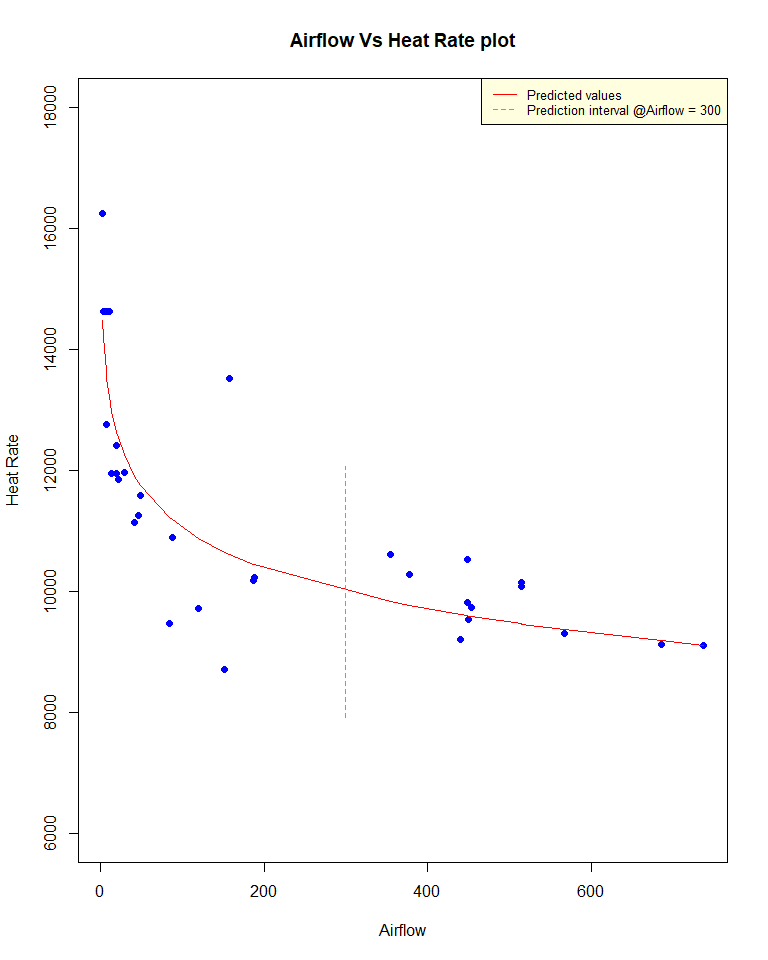

Linear Regression
================
Tapas Mishra

In this documents , we will look , various questions and understand ,
how we can solve them by Regression. In process , We will understand,
the application of Linear Regression and implementation using R.

The data sets can be found at below location -
<https://github.com/tmishra4/Statistical-Computation>

### Question 1

You may have been told that juice drinks are “nothing but sugar.” Read
in the dataset “cordial-simple.csv”, which has the nutrition information
for several different cordial brands and flavours. Consider predicting
Energy in kJ with grams of Total Sugar

###### Question 1(a)

Suppose these drinks are ideed “nothing but sugar”, and sugar contains
16.7 kJ per gram. Formulate an appropriate null hypothesis for

and  that reflects this status quo. Make a scatter plot of the
data; add both the line of best fit and your hypothesized line.

###### Sol. 1(a)

So the null hypothesis
 for

is  = 0, and corresponding alternate hypothesis
 for

is  \!= 0 and null hypothesis for

is  = 16.7 and corresponding alternate hypothesis for

is  \!= 16.7 Now creating the plot

``` r
library(rmarkdown)
data.cordial = read.csv("E:\\Projects\\Statistical Computation\\Statistical-Computation\\cordial-simple.csv")

fit <- lm( Energy ~ TotalSugar, data = data.cordial)

plot(Energy ~TotalSugar  , data = data.cordial,
     main = "Total Sugar Vs Energy plot", xlab = "Total Sugar in gms", ylab= "Enerygy in KJ", pch = 19)
lines(x = data.cordial$TotalSugar, y =16.7* data.cordial$TotalSugar ,col="red", lty=2)
#abline(a=0, b=16.7*data.cordial$TotalSugar, col="red", lty=2)
abline(a=coef(fit)[1], b=coef(fit)[2], col = "blue")
legend("topleft",col=c("red", "blue"), legend= c("Hypothized Line", "Best fit line"),
       lty=2:1, cex=0.8,bg='lightyellow')
```

<!-- -->

###### Question 1(b)

Fit a linear model and report the output of the “summary” function.

###### Sol. 1(b)

    ## 
    ## Call:
    ## lm(formula = Energy ~ TotalSugar, data = data.cordial)
    ## 
    ## Residuals:
    ##     Min      1Q  Median      3Q     Max 
    ## -12.701  -3.454  -1.811   3.018  18.592 
    ## 
    ## Coefficients:
    ##             Estimate Std. Error t value Pr(>|t|)    
    ## (Intercept)  4.57233    0.93856   4.872 7.09e-06 ***
    ## TotalSugar  16.19326    0.04828 335.395  < 2e-16 ***
    ## ---
    ## Signif. codes:  0 '***' 0.001 '**' 0.01 '*' 0.05 '.' 0.1 ' ' 1
    ## 
    ## Residual standard error: 5.482 on 67 degrees of freedom
    ## Multiple R-squared:  0.9994, Adjusted R-squared:  0.9994 
    ## F-statistic: 1.125e+05 on 1 and 67 DF,  p-value: < 2.2e-16

So the output of the summary shows the regression fit line has intercept
of 4.5 and slope of 16.19 for Total sugar. The null hypotheis that slope
of Total sugar is 0 is rejected, as we see small p-value for t-test.
Therefore , this model suggests that Energy in KJ can be predicted by
below equation

Energy(in KJ) = 4.5 + 16.19 \* TotalSugar(in gms)

###### Question 1(c)

Use the output to test the hypotheses in (1) against two sided
alternatives. State your conclusions.

###### Sol. 1(c)

``` r
#For the null hypotheisis that intercept is 0 

t_stat_B0 = 4.57/0.938
cat(" test statistics value for null hypothesis for Beta_0:" ,t_stat_B0 )
```

    ##  test statistics value for null hypothesis for Beta_0: 4.872068

``` r
cat("\n","critical value of Beta_0 for 69 degree of freedom :" ,qt(0.975, 69) )
```

    ## 
    ##  critical value of Beta_0 for 69 degree of freedom : 1.994945

``` r
t_stat_B1 = (16.19326 - 16.7)/0.04828

cat("\n","test statistics value for null hypothesis Beta_1:" ,t_stat_B1 )
```

    ## 
    ##  test statistics value for null hypothesis Beta_1: -10.49586

``` r
cat("\n","critical value of Beta_1 for 69 degree of freedom :" ,qt(0.975, 69) )
```

    ## 
    ##  critical value of Beta_1 for 69 degree of freedom : 1.994945

Comments : Therefore , looking at the null hypothesis test results for

, we can say : since test statistic for null hypothesis is 4.88 , which
is beyond the critical limits of +-1.99, Therefore rejecting the null
hyothesis that Beta\_0 i.e intercept is zero. So we can conclude that
intercept is required.

Similarly , looking at the null hypothesis test results for

, we can say : since test statistic for null hypothesis is -10.45 ,
which is beyond the critical limits of +-1.99, Therefore rejecting the
null hyothesis that
 is
16.7. So we can conclude that slope is is not 16.7.

###### Question 1(d)

Comment on how close the relationship is between Total Sugar and energy,
citing portions of your output in (2).

###### Sol. 1(d)

There is a very close relationship. The
 value indicates
that 0.999 of the variability in Energy is explained by the grams of
sugar in the drink.

Produce and include diagnostic plots. What assumptions are they
checking? Briefly comment on your conclusions.

``` r
par(mfrow=c(2,2))
plot(model.Energy, which=c(1,2,5,4)) #doesn't have to be exactly these plots
```

<!-- -->

Residual Vs fitted Plot : This plot checks the assumption that errors in
model have constant variance. if the relationships are linear than
points should appear to be randomly spread out about the line, with no
discernible non-linear trends or changes in variability. In this plot ,
We dont see any issue.

Normal QQ Plot : This plots checks the assumption that residuals are
roughly normally distributed. the points in the Q–Q plot will
approximately lie on the line y = x. In this plot we see that the
residuals deviate from the diagonal line in both the upper and lower
tail. The tails are observed to be ‘heavier’ (have larger values) than
what we would expect under the standard modeling assumptions.

Cooks Distance Plot : This plot check , if we have any influential
points. Above plot shows no influential points , as none of the
observation have cooks disdance of more than 0.5.

Residual Vs Leverage Plot : This plot is used to identify outliers and
high leverage points. Points, which have some unsual y values for some x
vlaues, which also have influence on model are called high leverage
points. outlier is any point that isn’t approximated well by the model
(has a large residual) and which significantly influences model fit (has
large leverage). We do not see any HLPs or outliers in this plot for the
model in consideration as none of the observations seems outside
contours.

###### Question 1(e)

Are there any drinks where the kJ and Total Sugar amounts given are
inconsistent, allowing that there may be other sources of kJ?

###### Sol. 1(e)

Yes, on the inital scatterplot we see several points below the solid
line, representing 16.7kJ for every gram of sugar. If the total sugar
measurement is accurate, the kJ of the drink may be higher than this
line due to other components (protein, non-sugar carbohydrates, etc).
However, points below the line are inconsistent with 16.7 kJ per gram of
sugar.

### Question 2

Your friend conjectures that citrus/blackcurrant flavored juice drinks
have more added sugar because of the natural tartness of these flavors.

###### Question 2(a)

Perform a t-test comparing the added sugar for citrus/blackcurrant
drinks vs other flavors. State your null and alternative hypotheses,
pvalue, and final conclusion. State which test (equal or unequal
variance) you used and
why.

###### Sol. 2(a)

``` r
t.test(TotalSugar~Flavour, data=data.cordial, var.equal=TRUE, alternative="greater")
```

    ## 
    ##  Two Sample t-test
    ## 
    ## data:  TotalSugar by Flavour
    ## t = -0.57412, df = 67, p-value = 0.7161
    ## alternative hypothesis: true difference in means is greater than 0
    ## 95 percent confidence interval:
    ##  -7.508665       Inf
    ## sample estimates:
    ## mean in group Citrus-Blackcurrant               mean in group Other 
    ##                          12.95789                          14.88065

:
mean(citrus-blackcurrant) ≤ or = mean(other)
:
mean(citrus-blackcurrant) \> mean(other) (Note this is one sided.)

We see that the test statistic is within the range of critical value ,
therefore the null hypothesis is not rejected. High p-value also
strengthen the null hypothesis. Therefore , The Citrus and Blackcurrant
drinks do not have more sugar.

Since the one sample approximately have equal numbers of data points and
also the approximate same variance. We will use equal varaince t-test.

###### Question 2(b)

Produce a visualization suitable for comparing the added sugar in the
two groups of drinks. \#\#\#\#\#\# Sol. 2(b)

``` r
boxplot(TotalSugar~Flavour,
data=data.cordial,
main="Boxplots for Total Sugar for each Flvour",
xlab="Flavours",
ylab="Total Sugar",
col="orange",
border="brown"
)
```

<!-- -->

The above box plot shows comparison of the added sugar in the two groups
of drinks . Although the mean and median of Total sugar for both are
flavours are pretty same , the length or height of box plot for
Citrus-Blackcurrent is more than that of other flavours, implying
interquartile range of Total sugar in sample is larger for
Citrus-Blackcurrent group compared to Other group.

###### Question 2(c)

Are there serious deviations from the assumptions of the t-test?
Explain.

###### Sol. 2(c)

The assumption of the t-test is that the sample means in both groups are
approximately normally distributed. (We also assume the measurements are
randomly sampled from the two populations, but we are not given
information about how this was done.) Normality of the sample mean
happens either when both populations have a normal distribution, or the
sample size is large. In both groups, the distribution of sugar content
is somewhat asymetric (and therefore non-normal). However:

``` r
table(data.cordial$Flavour)
```

    ## 
    ## Citrus-Blackcurrant               Other 
    ##                  38                  31

both groups have more than 30 observations so the sample means should be
approximately normal. There are no serious deviations from the test
assumptions.

###### Question 2(d)

Comment on whether the mean is a good way to characterize the typical
amount of added sugar for these two flavour groups.

###### Sol. 2(d)

No , mean is not a good way to characterize the typical amount of added
sugar for these two flavour groups , because mean could be seriously
impacted due to some extreme or unusual points and distort the
understanding of characterstic amount of added sugar for a perticular
group.

#### Question 3

Consider the data in the file “carseats-simple.csv.” The response is the
number of carseats of a particular brand sold (in thousands) at
different locations over the course of a year. The predictor is the
price in dollars of the carseat at that location. The data has been
collected by a consumer agency that has no role in setting the price.

###### Question 3(a)

Produce a scatterplot of the data, including the line of best
fit

###### Sol. 3(a)

``` r
data.carseat = read.csv("E:\\Projects\\Statistical Computation\\Statistical-Computation\\carseats-simple.csv")
str(data.carseat)
```

    ## 'data.frame':    400 obs. of  2 variables:
    ##  $ Sales: num  9.5 11.22 10.06 7.4 4.15 ...
    ##  $ Price: int  120 83 80 97 128 72 108 120 124 124 ...

scatterplot of the data, including the line of best fit

``` r
plot(Sales ~Price  , data = data.carseat,
     main = "Sales Vs Price plot for Carseat", xlab = "Price in dollors", ylab= "Sales (in thousands ", pch = 19, col = "pink")
lines(x = data.carseat$Price, y = (lm( Sales ~ Price, data = data.carseat))$fitted.values ,col="red", lty=2)


legend("topright",col=c("red"), legend= c( "Best fit line"),
       lty=2, cex=0.8,bg='lightyellow')
```

<!-- -->

###### Question 3(b)

Test for a relationship between the sales and the price. Give your
conclusion, referring to relevant portions of your output.

###### Sol. 3(b)

``` r
carseat.model = lm (Sales ~ Price,  data= data.carseat)
summary(carseat.model)
```

    ## 
    ## Call:
    ## lm(formula = Sales ~ Price, data = data.carseat)
    ## 
    ## Residuals:
    ##     Min      1Q  Median      3Q     Max 
    ## -6.5227 -1.8454 -0.1464  1.6496  7.5113 
    ## 
    ## Coefficients:
    ##              Estimate Std. Error t value Pr(>|t|)    
    ## (Intercept) 13.638582   0.632718  21.556   <2e-16 ***
    ## Price       -0.053042   0.005354  -9.908   <2e-16 ***
    ## ---
    ## Signif. codes:  0 '***' 0.001 '**' 0.01 '*' 0.05 '.' 0.1 ' ' 1
    ## 
    ## Residual standard error: 2.532 on 398 degrees of freedom
    ## Multiple R-squared:  0.1978, Adjusted R-squared:  0.1958 
    ## F-statistic: 98.16 on 1 and 398 DF,  p-value: < 2.2e-16

Looking at both scatter plot and output of the liner model , we conclude
that price has a negative relationship with sales of cars. That is as
the price of cars increase , the sales of cars decrease, which we see in
daily life as well. we do see more cheaper cars on road as compared to
costly cars. The small p-value of for slope of Price , do tell us that
Price is significantly important predictor , in predicting cars sales,
and its -ve sign tells us that , it bears a negative relationship with
Sales.

###### Question 3(c)

What is our uncertainty about the average number of sales for locations
where the price is $150? Give a confidence interval for this
quantity.

###### Sol. 3(c)

``` r
predict(carseat.model, interval="confidence",newdata=data.frame(Price=c(150)))
```

    ##        fit     lwr      upr
    ## 1 5.682271 5.24461 6.119931

So the predicted average number of sales for locations where the price
is $150 would be 5682. This predicted average number of sales has 5%
uncertainity i.e at price $150 , the total sales could range between
5244 to 6111

###### Question 3(d)

Suppose we observe a location has set the price at $150. Give a
prediction interval for the sales at that location. Explain why it is
larger than the interval in (3).

###### Sol. 3(d)

so, prediction interval for the sales at that location where the price
is
$150.

``` r
predict(carseat.model, interval="prediction",newdata=data.frame(Price=c(150)))
```

    ##        fit      lwr      upr
    ## 1 5.682271 0.685397 10.67914

The prediction interval is larger than the confidence interval in 3(3)
because the standard error for a confidence interval on the mean values
of sales takes into account only the uncertainty due to sampling,
however standard error for a prediction interval on an individual Sales
observation takes into account the uncertainty due to sampling and also
the the variability of the individuals Sales around the predicted mean
of Sales. Therefore , since the standard error for the prediction
interval is wider , so the prediction interval is larger than the
confidence interval.

###### Question 3(e)

Suppose we change the price at a location previously charging $200 to
$150. Should we use the interval above to predict sales at the new
price? Explain any reservations you have.

###### Sol. 3(e)

We should’nt be using the interval above to predict sales at the new
price. if we use prediction interval , we have to be cautious, because
this is observation data , not the experimental data . In an
experimental setup , we deliberately create a set up and factors
influencing the response are controlled, however here we cant simply say
that model has captured all the factors driving the sales on an
observation data.

#### Question 4

Consider the data in the file “turbine-simple.csv.” A gas turbine is an
internal combustion engine used to generate electricity. A key measure
of how well the turbine works is the heat rate, the energy input divided
by the electricity generated (with lower heat rate being better). We are
interested in how it is related to the airflow through the turbine.

###### Question 4(a)

Produce a scatterplot of the data. Describe the relationship between
airflow and heat
rate.

###### Sol. 4(a)

``` r
data.turbine = read.csv("E:\\Projects\\Assignment Datasets\\turbine-simple.csv")
summary(data.turbine)
```

    ##     Airflow         HeatRate    
    ##  Min.   :  3.0   Min.   : 8714  
    ##  1st Qu.: 21.5   1st Qu.: 9734  
    ##  Median :136.0   Median :10566  
    ##  Mean   :226.3   Mean   :11161  
    ##  3rd Qu.:448.0   3rd Qu.:11952  
    ##  Max.   :737.0   Max.   :16243

``` r
str(data.turbine)
```

    ## 'data.frame':    32 obs. of  2 variables:
    ##  $ Airflow : int  3 4 8 152 84 14 20 354 378 515 ...
    ##  $ HeatRate: int  16243 14628 12766 8714 9469 11948 12414 10604 10270 10144 ...

So , the summary shows both Airflow and Heatrate are contineous integer
variable.

``` r
plot(HeatRate~Airflow  , data = data.turbine,
     main = "Airflow Vs Heat Rate plot",  pch = 19 , col="blue", ylab="Heat Rate", xlab = "Airflow")
lines(lowess(data.turbine$HeatRate~data.turbine$Airflow) , lty = 2, col = "red")
```

<!-- -->

HeatRate is negatively related with Airflow. Heatrate is maximum at
lowest Airflow , however Looking at the lowess curve , We see that
heatrate drops until airflow is 200, post that , there is not much
change in heatrate , with increase in airflow. Overall the relationship
, does not seem to be linear.

###### Question 4(b)

Try a few different transformations of airflow, with the aim of making
the relationship more linear. Show plots of the different
transformations you have tried (at least three) and indicate which you
like the best.

###### Sol. 4(b)

``` r
par(mfrow = c(3,1))

# applying log transformation
plot(HeatRate~log(Airflow)  , data = data.turbine,
     main = "Airflow Vs Heat Rate plot",  pch = 19 , col="blue" ,xlab="log(Airflow)", ylab = "Heat Rate")
lines(lowess(data.turbine$HeatRate~ log(data.turbine$Airflow)) , lty = 2, col = "red")

# applying square transformation
plot(HeatRate~I(Airflow^2)  , data = data.turbine,
     main = "Airflow Vs Heat Rate plot",  pch = 19 , col="blue" ,xlab="(Airflow)^2", ylab = "Heat Rate")
lines(lowess( data.turbine$HeatRate~ I(data.turbine$Airflow^2)) , lty = 2, col = "red")

# applying square root transformation
plot(HeatRate~sqrt(Airflow)   , data = data.turbine,
     main = "Airflow Vs Heat Rate plot",  pch = 19 , col="blue",xlab="sqrt(Airflow)", ylab = "Heat Rate")
lines(lowess( data.turbine$HeatRate~sqrt(data.turbine$Airflow)) , lty = 2, col = "red")
```

<!-- -->

On applying log transformation on Airflow , we do see relationship
between log(Airflow) and Heat rate moving close to linear relationship.
However , on squaring airflow or applying square root on airflow , do
not have much impact on changing the relationship from non-linear to
linear.

###### Question 4(c)

Fit a linear model using the transformation you determined in (2). Show
the prediction from this model as a curve on your scatterplot from (1).
Create a prediction interval for the heat rate when the airflow is 300.
Add this interval to your scatterplot as well.

###### Sol. 4(c)

``` r
turbine.model = lm( HeatRate~log(Airflow)  , data = data.turbine)
summary(turbine.model)
```

    ## 
    ## Call:
    ## lm(formula = HeatRate ~ log(Airflow), data = data.turbine)
    ## 
    ## Residuals:
    ##     Min      1Q  Median      3Q     Max 
    ## -1935.7  -578.7  -118.1   539.2  2911.2 
    ## 
    ## Coefficients:
    ##              Estimate Std. Error t value Pr(>|t|)    
    ## (Intercept)   15556.7      509.5  30.536  < 2e-16 ***
    ## log(Airflow)   -976.7      106.3  -9.191 3.14e-10 ***
    ## ---
    ## Signif. codes:  0 '***' 0.001 '**' 0.01 '*' 0.05 '.' 0.1 ' ' 1
    ## 
    ## Residual standard error: 992.7 on 30 degrees of freedom
    ## Multiple R-squared:  0.7379, Adjusted R-squared:  0.7292 
    ## F-statistic: 84.47 on 1 and 30 DF,  p-value: 3.144e-10

We do see , negative correlation identified in scatterplots , is shown
in this model by the negative slope of log(Airflow). Overall, model
shows log(Airflow) is required in this model , because of the low
p-value for
log(Airflow).

``` r
with(data.turbine, plot(Airflow, HeatRate, main = "Airflow Vs Heat Rate plot",  pch = 19 , col="blue" ,xlab="Airflow", ylab = "Heat Rate"))
lines(data.turbine$Airflow[order(data.turbine$Airflow)], predict(turbine.model, newdata=data.turbine[order(data.turbine$Airflow),]), col="red")
legend("topright",col=c("red"), legend= c("Predicted values"),
       lty=2, cex=0.8,bg='lightyellow')
```

<!-- -->

Now , creating prediction interval for the heat rate when the airflow is
300.

``` r
#predict(turbine.model, interval="prediction")
pred_interval = predict(turbine.model, interval="prediction",newdata=data.frame(Airflow=c(300)))
pred_interval
```

    ##        fit      lwr      upr
    ## 1 9985.567 7910.194 12060.94

``` r
with(data.turbine, plot(Airflow, HeatRate, main = "Airflow Vs Heat Rate plot",  pch = 19 , col="blue" ,xlab="Airflow", ylab = "Heat Rate", ylim = c(6000,18000)))
lines(data.turbine$Airflow[order(data.turbine$Airflow)], predict(turbine.model, newdata=data.turbine[order(data.turbine$Airflow),]), col="red")

lines(c(300,300), c(pred_interval[,2],pred_interval[,3] ), col = "green", lty=2)
legend("topright",col=c("red", "green"), legend= c("Predicted values", "Prediction interval @Airflow = 300"),
       lty=1:2, cex=0.8,bg='lightyellow')
```

<!-- -->
